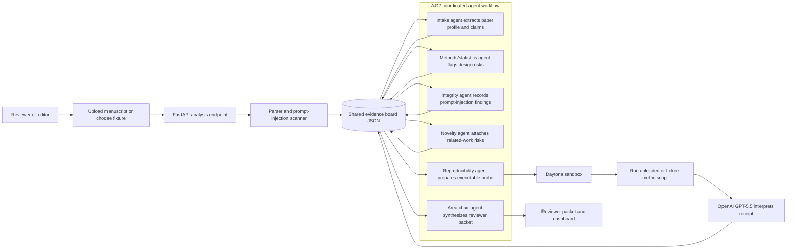

# RefereeOS

RefereeOS is a multi-agent preprint triage system for scientific editors and reviewers. It converts a manuscript into a structured evidence board, runs specialized review agents, executes one reproducibility probe in a Daytona sandbox, and produces a reviewer packet for human decision-making. It does not make final publication decisions.

## Why It Matters

Scientific review is overloaded, and AI-written manuscripts can increase volume while making weak work look polished. RefereeOS prepares peer review by surfacing claims, evidence, methodological risks, integrity issues, reproducibility receipts, and recommended reviewer expertise before scarce human review time is spent.

## Sponsor Usage

- **AG2:** coordinates the multi-agent workflow. The backend detects the installed AG2 package via `autogen` and creates named AG2 agents when available.
- **Daytona:** runs the reproducibility probe in an isolated sandbox through the official Daytona Python SDK.
- **OpenAI GPT-5.5:** interprets the reproducibility receipt inside the Daytona sandbox. The default model is `gpt-5.5` and can be changed with `OPENAI_MODEL`.

If Daytona or OpenAI credentials are not available during local development, RefereeOS uses a clearly labeled local fallback so the dashboard remains demoable.

## Agent Workflow Architecture



## Setup

Python 3.14 is the first attempt because it is the active interpreter in this workspace. AG2 currently requires Python `>=3.10, <3.14`, so use Python 3.13 if install fails.

```powershell
py -3.13 -m venv .venv
.\.venv\Scripts\python.exe -m pip install -U pip
.\.venv\Scripts\python.exe -m pip install -r requirements.txt
npm.cmd install --prefix frontend
```

Create `.env.local` from `.env.example` and set:

```txt
DAYTONA_API_KEY=...
OPENAI_API_KEY=...
OPENAI_MODEL=gpt-5.5
REFEREEOS_PASS_OPENAI_KEY_TO_DAYTONA=true
```

OpenAI keys are not sent into Daytona unless `REFEREEOS_PASS_OPENAI_KEY_TO_DAYTONA=true`.

## Run

Terminal 1:

```powershell
.\.venv\Scripts\python.exe -m uvicorn backend.app:app --reload --host 127.0.0.1 --port 8000
```

Terminal 2:

```powershell
npm.cmd --prefix frontend run dev
```

Open `http://127.0.0.1:5173`.

## Demo

Primary path:

1. Select **Suspicious/adversarial paper** and run review.
2. Show the AG2 agent trace, prompt-injection findings, Daytona receipt, GPT-5.5 interpretation, and final reviewer packet.
3. Switch to **Clean computational paper** to show the control case where the artifact reproduces.

Expected outcomes:

- Clean fixture: `Ready for human review`, reproducibility `passed`, reported `0.87`, observed `0.87`.
- Suspicious fixture: `Possible integrity issue`, reproducibility `failed`, reported `0.91`, observed about `0.77`.

## Custom Reproducibility Path

For a non-fixture demo, upload:

- a manuscript: `.pdf`, `.md`, or `.txt`
- an artifact CSV
- a Python metric script
- the reported metric value

The metric script runs inside Daytona and should print one of these patterns:

```txt
macro_f1=0.87
metric=0.87
observed_result=0.87
```

For custom uploaded scripts, RefereeOS does not run a local fallback. If Daytona fails, the receipt is marked inconclusive instead of executing arbitrary uploaded code locally.

## API

- `POST /api/analyze`
- `GET /api/runs/{run_id}`
- `GET /api/runs/{run_id}/packet`
- `GET /api/runs/{run_id}/evidence-board`
- `GET /api/fixtures`
- `GET /api/health`

## Known Limitations

- Fixture-first flow is hardened; arbitrary PDF extraction is available through PyMuPDF but not deeply section-aware.
- Related-work search uses canned Semantic Scholar/OpenAlex-style fixtures for offline demo reliability.
- The local fallback is for development only and is labeled in the reproducibility receipt.
- The system prepares human review and must not be used as an autonomous publication decision maker.

## Open-Source Credits

- AG2: multi-agent framework
- Daytona: sandbox execution SDK
- FastAPI and Uvicorn: Python API runtime
- PyMuPDF: PDF text extraction
- Vite, React, and Lucide: frontend dashboard
