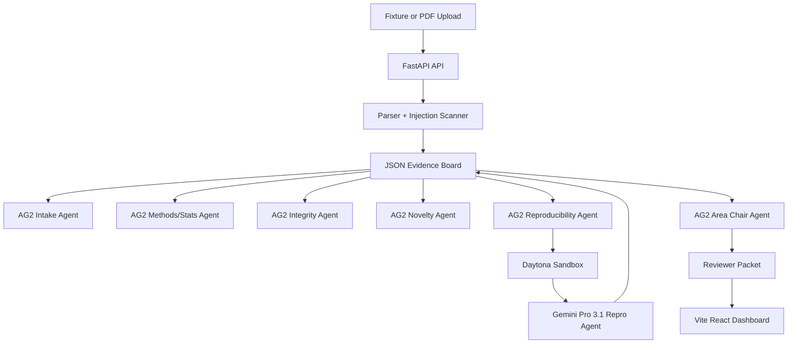

# RefereeOS

RefereeOS is a multi-agent preprint triage system for scientific editors and reviewers. It converts a manuscript into a structured evidence board, runs specialized review agents, executes one reproducibility probe in a Daytona sandbox, and produces a reviewer packet for human decision-making. It does not make final publication decisions.

## Why It Matters

Scientific review is overloaded, and AI-written manuscripts can increase volume while making weak work look polished. RefereeOS prepares peer review by surfacing claims, evidence, methodological risks, integrity issues, reproducibility receipts, and recommended reviewer expertise before scarce human review time is spent.

## Sponsor Usage

- **AG2:** coordinates the multi-agent workflow. The backend detects the installed AG2 package via `autogen` and creates named AG2 agents when available.
- **Daytona:** runs the reproducibility probe in an isolated sandbox through the official Daytona Python SDK.
- **Gemini Pro 3.1:** acts as the full reproducibility agent inside the Daytona sandbox. The default model is `gemini-3.1-pro-preview` and can be changed with `GEMINI_MODEL`.

If Daytona or Gemini credentials are not available during local development, RefereeOS uses a clearly labeled local fallback so the dashboard remains demoable.

## Architecture



## Setup

Python 3.14 is the first attempt because it is the active interpreter in this workspace. AG2 currently requires Python `>=3.10, <3.14`, so use Python 3.13 if install fails.

```powershell
py -3.13 -m venv .venv
.\.venv\Scripts\python.exe -m pip install -U pip
.\.venv\Scripts\python.exe -m pip install -r requirements.txt
npm.cmd install --prefix frontend
```

Create `.env` from `.env.example` and set:

```txt
DAYTONA_API_KEY=...
GEMINI_MODEL=gemini-3.1-pro-preview
```

The hackathon sponsor environment may provide Gemini access inside Daytona. If you need to pass a key explicitly, set `GEMINI_API_KEY` or `GOOGLE_API_KEY`.

## Run

Terminal 1:

```powershell
.\.venv\Scripts\python.exe -m uvicorn backend.app:app --reload --host 127.0.0.1 --port 8000
```

Terminal 2:

```powershell
npm.cmd --prefix frontend run dev
```

Open `http://127.0.0.1:5173`.

## Demo

1. Select **Clean computational paper** and run review.
2. Show AG2 agent trace, evidence board, Daytona/Gemini reproducibility receipt, and final packet.
3. Select **Suspicious/adversarial paper** and run review.
4. Show prompt-injection finding and failed/inconclusive reproducibility result.

## API

- `POST /api/analyze`
- `GET /api/runs/{run_id}`
- `GET /api/runs/{run_id}/packet`
- `GET /api/runs/{run_id}/evidence-board`
- `GET /api/fixtures`
- `GET /api/health`

## Known Limitations

- Fixture-first flow is hardened; arbitrary PDF extraction is available through PyMuPDF but not deeply section-aware.
- Related-work search uses canned Semantic Scholar/OpenAlex-style fixtures for offline demo reliability.
- The local fallback is for development only and is labeled in the reproducibility receipt.
- The system prepares human review and must not be used as an autonomous publication decision maker.

## Open-Source Credits

- AG2: multi-agent framework
- Daytona: sandbox execution SDK
- FastAPI and Uvicorn: Python API runtime
- PyMuPDF: PDF text extraction
- Vite, React, and Lucide: frontend dashboard
