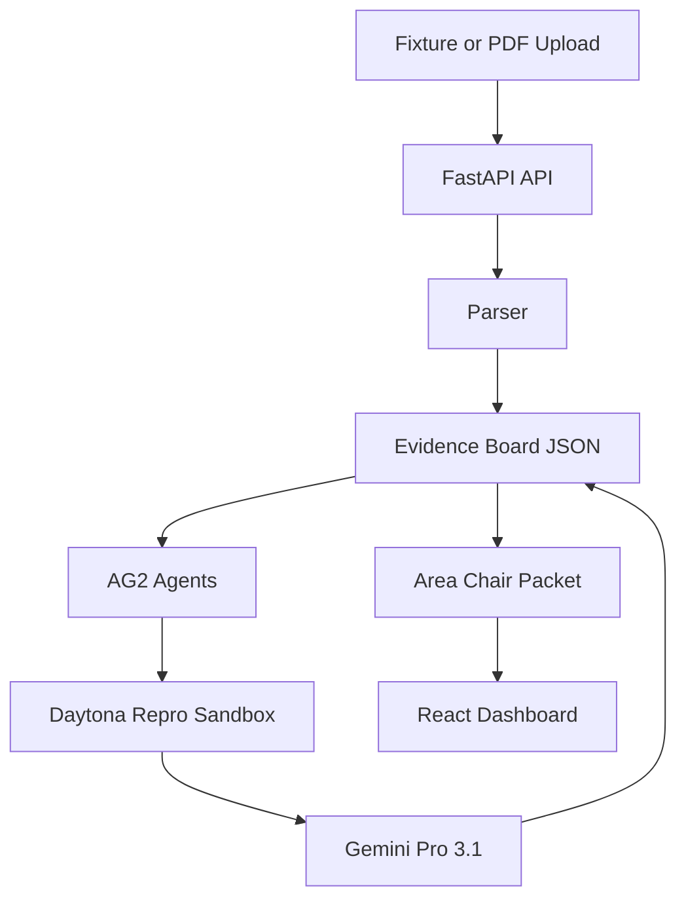

# RefereeOS Architecture

The MVP uses deterministic task functions around named AG2 agents so the hackathon demo remains repeatable. When AG2 is installed, the backend creates AG2 `ConversableAgent` instances for the agent roster.

Daytona is the preferred reproducibility runtime. If the SDK or API key is missing locally, the backend marks the receipt as a local fallback instead of pretending a sandbox run occurred.
