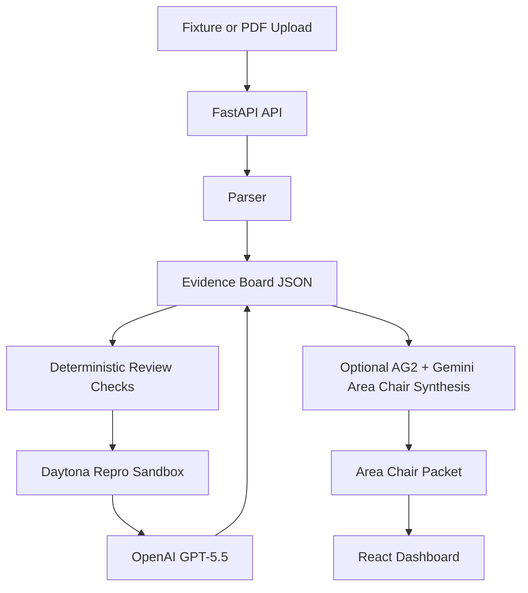

# RefereeOS Architecture

The extraction, methods/statistics, integrity, novelty, and triage stages are deterministic so the hackathon demo remains repeatable. When `REFEREEOS_ENABLE_AG2_LLM=true` and a Gemini key is configured, the area-chair stage also calls AG2 through `autogen.ConversableAgent` for reviewer-packet synthesis. If AG2 or Gemini is unavailable, RefereeOS records the fallback in evidence-board metadata and still produces the deterministic packet.

Daytona is the preferred reproducibility runtime. If the SDK or API key is missing locally, the backend marks the receipt as a local fallback instead of pretending a sandbox run occurred.
