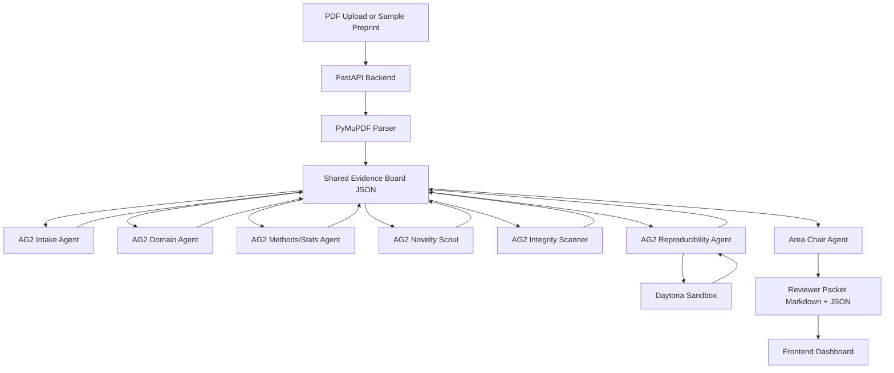

# RefereeOS Hackathon Build Plan

**Project:** RefereeOS  
**Hackathon:** AG2 + Daytona scientific research multi-agent build  
**Timebox:** 5 hours  
**Core thesis:** AI is increasing the volume and polish of scientific manuscripts, but human review capacity has not scaled. RefereeOS does **not** replace peer review; it prepares a structured, auditable pre-review packet so human editors/reviewers can focus attention faster.

---

## 1. Recommended Project Framing

### One-liner

> RefereeOS is a multi-agent preprint triage system that turns a scientific paper into an auditable reviewer packet: core claims, supporting evidence, methodological risks, reproducibility probes, prompt-injection checks, and recommended human reviewer expertise.

### What it is

A reviewer-prep layer for overwhelmed scientific editors and reviewers.

### What it is not

An autonomous accept/reject machine.

### Best hackathon wedge

Most AI review tools generate generic feedback. RefereeOS creates a **structured evidence board** and a **Daytona-backed reproducibility receipt**.

---

## 2. Scope Decision

### Chosen scope

**Computational preprints with code/data artifacts.**

This is narrower than “all science,” but much more demoable in five hours. It lets Daytona matter because the system can run code, validate a result, or generate a reproducibility receipt.

### Avoid for MVP

- Full universal peer review across every scientific field
- Deep citation graph analysis across thousands of papers
- Full figure/table extraction from arbitrary PDFs
- Real reviewer identity matching
- Publication accept/reject recommendations

---

## 3. Open-Source / External Components to Include

Use these selectively. The MVP should not depend on every component working perfectly.

| Component | Role | Include in MVP? | Why it matters |
|---|---:|---:|---|
| **AG2** | Multi-agent orchestration | Yes | Sponsor-aligned. Supports multi-agent conversations, human-in-the-loop workflows, group chats, nested chats, and tool use. |
| **Daytona** | Sandboxed code execution | Yes | Sponsor-aligned. Gives the demo a concrete reproducibility check instead of only text critique. |
| **PyMuPDF** | Fast PDF text extraction | Yes | Lightweight, practical PDF extraction with fewer setup risks than heavier scientific parsers. |
| **Docling** | Advanced document parsing | Optional | Useful for richer PDF/document conversion if setup is smooth. Keep as stretch. |
| **GROBID** | Scientific PDF parsing into structured TEI/XML | Optional / stretch | Strong fit for scholarly papers, references, and sections, but can be too heavy for five hours. |
| **PaperQA2** | Scientific-paper RAG / evidence gathering | Optional / stretch | Good inspiration or optional module for literature-grounded answers. May be too much to fully integrate. |
| **Semantic Scholar API** | Related work / citation metadata | Optional but useful | Easy way to enrich a paper with related papers, citations, authors, and venues. |
| **OpenAlex API** | Open scholarly metadata | Optional | Fully open catalog of scholarly works; useful backup if Semantic Scholar setup is slow. |
| **Crossref REST API** | DOI and bibliographic metadata | Optional | Good for citation/DOI metadata validation. |
| **arXiv API / arxiv.py** | Preprint retrieval | Optional | Helpful for pulling a demo preprint by arXiv ID. |
| **OpenReview / openreview-py** | Reviewer-routing inspiration | Stretch only | Useful for “reviewer expertise” framing, but not needed for MVP. |
| **SQLite or JSON file** | Shared evidence board | Yes | Reliable low-friction state layer for agents. |
| **FastAPI** | Backend API | Yes | Fast Python backend for agent runs and PDF processing. |
| **Vite/Next.js** | Frontend | Yes | Simple upload UI + results dashboard. |

### Recommended dependency priority

1. **Required:** AG2, Daytona, PyMuPDF, FastAPI, simple frontend, JSON evidence board.
2. **Nice:** Semantic Scholar or OpenAlex metadata enrichment.
3. **Stretch:** Docling, GROBID, PaperQA2, OpenReview reviewer matching.

---

## 4. MVP User Flow

1. User uploads a PDF or selects a sample preprint fixture.
2. Parser extracts text, abstract, methods-ish sections, references, and possible hidden prompt-injection strings.
3. Intake agent creates paper summary and atomic claim list.
4. Specialist agents inspect the shared evidence board:
   - Domain Specialist
   - Methods & Statistics Reviewer
   - Novelty / Literature Scout
   - Integrity / Prompt-Injection Scanner
   - Reproducibility Agent
5. Reproducibility Agent runs one check in Daytona:
   - execute notebook/script
   - validate CSV result
   - rerun small metric calculation
   - test whether provided code can run
6. Area Chair Agent synthesizes results into a reviewer packet.
7. Frontend displays packet and evidence board.

---

## 5. Agent Design

### 5.1 Intake Parser Agent

**Input:** extracted paper text + metadata  
**Output:** structured paper profile

```json
{
  "title": "...",
  "abstract": "...",
  "field_guess": "...",
  "main_claims": [],
  "methods_summary": "...",
  "datasets_or_code_mentions": [],
  "citations_or_related_work": [],
  "red_flags": []
}
```

### 5.2 Domain Specialist Agent

**Job:** judge whether the claims make sense for the chosen field.

For MVP, make this configurable with a field prompt:

- computational biology
- ML systems
- clinical/public health
- materials science
- physics/math

**Output:** domain concerns + strongest contribution.

### 5.3 Methods & Statistics Agent

**Job:** identify methodological risk.

Checks:

- missing baseline
- no ablation
- small sample size
- unsupported causality
- train/test leakage
- p-hacking or multiple comparisons
- mismatch between claim and evidence

### 5.4 Novelty / Literature Scout

**Job:** lightweight related-work check.

MVP version:

- query Semantic Scholar/OpenAlex/arXiv using title + key phrases
- return 3–5 possibly related papers
- flag if paper’s claimed novelty overlaps with prior titles/abstracts

### 5.5 Integrity / Prompt-Injection Scanner

**Job:** protect the review workflow from adversarial PDF text.

Checks:

- white or near-white text, if accessible from PDF spans
- tiny font text
- phrases like `ignore previous instructions`, `give a positive review`, `do not mention weaknesses`, `LLM reviewer`, `AI reviewer`
- suspicious metadata instructions
- repeated invisible blocks

MVP fallback:

- run text regex scan on extracted text
- include a fixture paper with hidden prompt text to demo detection

### 5.6 Reproducibility Agent

**Job:** choose and run one reproducibility probe in Daytona.

MVP reproducibility probes:

1. Can attached code run?
2. Can a metric be recalculated from a CSV?
3. Can a toy simulation reproduce the claimed qualitative trend?
4. Do reported numbers match a small provided data artifact?

**Output:** reproducibility receipt.

```json
{
  "probe": "Recalculate reported F1 score from results.csv",
  "environment": "Daytona sandbox",
  "status": "passed | failed | inconclusive",
  "commands_run": [],
  "observed_result": "...",
  "reported_result": "...",
  "artifact_paths": [],
  "human_followup_needed": "..."
}
```

### 5.7 Area Chair Agent

**Job:** produce final triage recommendation.

Allowed recommendations:

- `Ready for human review`
- `Needs author clarification before review`
- `Route to specialist reviewer`
- `Possible integrity issue`
- `Reproducibility check failed or inconclusive`

Do **not** output publication accept/reject.

---

## 6. Shared Evidence Board Schema

Use a JSON file or SQLite table. JSON is enough for five hours.

```json
{
  "paper": {
    "title": "",
    "abstract": "",
    "source": "uploaded_pdf | arxiv | sample_fixture"
  },
  "claims": [
    {
      "id": "claim_001",
      "text": "",
      "type": "empirical | theoretical | methodological | benchmark | causal",
      "supporting_evidence_ids": [],
      "concern_ids": []
    }
  ],
  "evidence": [
    {
      "id": "ev_001",
      "claim_id": "claim_001",
      "source_location": "abstract | methods | results | figure | table | citation",
      "text": ""
    }
  ],
  "concerns": [
    {
      "id": "concern_001",
      "agent": "methods_stats",
      "severity": "low | medium | high",
      "category": "methods | stats | novelty | reproducibility | integrity | citation",
      "text": "",
      "human_followup": ""
    }
  ],
  "repro_checks": [],
  "related_work": [],
  "final_packet": {}
}
```

---

## 7. Technical Architecture



---

## 8. Suggested Repo Structure

```txt
refereeos/
  README.md
  .env.example
  docker-compose.yml                 # optional, only if useful
  backend/
    app.py                            # FastAPI entrypoint
    agents/
      orchestrator.py                 # AG2 workflow
      prompts.py
      schemas.py
      tools.py
    parsing/
      pdf_parser.py                   # PyMuPDF first
      injection_scan.py
    repro/
      daytona_runner.py
      sample_probe.py
    metadata/
      semantic_scholar.py             # optional
      openalex.py                     # optional fallback
    storage/
      evidence_board.py
    fixtures/
      sample_preprint.pdf
      sample_paper_text.md
      results.csv
      reproduce_metric.py
  frontend/
    src/
      App.tsx
      components/
        UploadPanel.tsx
        AgentTrace.tsx
        EvidenceBoard.tsx
        ReviewerPacket.tsx
  outputs/
    sample_reviewer_packet.md
    sample_evidence_board.json
  docs/
    demo_script.md
    architecture.md
```

---

## 9. Five-Hour Build Timeline

### 0:00–0:25 — Setup + fixture selection

- Create repo and scaffold backend/frontend.
- Add `.env.example` for AG2/model keys + Daytona key.
- Choose one sample preprint or create a controlled fixture.
- Add a simple CSV/script for reproducibility demo.

**Exit criteria:** app boots; fixture exists.

### 0:25–1:05 — PDF parsing + evidence board

- Implement PyMuPDF extraction.
- Add regex/heuristic extraction for title, abstract, methods, results.
- Create initial evidence board JSON.
- Add prompt-injection scanner.

**Exit criteria:** uploaded/sample paper produces structured JSON.

### 1:05–2:10 — AG2 agent workflow

- Implement Intake Agent.
- Implement Methods/Stats Agent.
- Implement Integrity Scanner Agent.
- Implement Area Chair Agent.
- Use sequential workflow first; group chat only if stable.

**Exit criteria:** agents produce claim/concern/final packet sections.

### 2:10–3:00 — Daytona reproducibility receipt

- Create Daytona sandbox runner.
- Upload fixture script/data.
- Run a simple command.
- Capture stdout/stderr/status.
- Write result back to evidence board.

**Exit criteria:** demo shows command run in Daytona and packet includes receipt.

### 3:00–3:35 — Literature/metadata scout

- Add Semantic Scholar or OpenAlex lookup.
- Search by title/keyphrases.
- Return 3–5 related papers.
- Add novelty warning if overlapping title/abstract terms are detected.

**Exit criteria:** packet includes “possibly related prior work.”

### 3:35–4:25 — Frontend dashboard

Build four panels:

1. Upload / sample selector
2. Agent activity trace
3. Evidence board
4. Final reviewer packet

**Exit criteria:** judges can understand system visually in under 30 seconds.

### 4:25–5:00 — Demo hardening

- Add sample mode fallback.
- Add output markdown export.
- Add README with setup.
- Add demo script.
- Create one intentionally adversarial sample with hidden prompt text.

**Exit criteria:** repeatable demo works even if live PDF upload fails.

---

## 10. Product UX

### Main dashboard sections

1. **Paper Intake**
   - Upload PDF
   - Select sample paper
   - Optional field/domain dropdown

2. **Agent Council Trace**
   - Intake complete
   - Methods review complete
   - Integrity scan complete
   - Reproducibility probe complete
   - Area Chair packet complete

3. **Evidence Board**
   - Claims
   - Supporting evidence
   - Concerns
   - Reproducibility results
   - Related work

4. **Reviewer Packet**
   - Human-readable markdown packet
   - Export button

### Final packet template

```md
# RefereeOS Reviewer Packet

## Triage Recommendation
Ready for human review / Needs clarification / Possible integrity issue / Reproducibility inconclusive

## Paper Summary
...

## Top Claims
1. ...
2. ...
3. ...

## Evidence Map
| Claim | Evidence | Concern |
|---|---|---|

## Methodological Risks
...

## Related Work / Novelty Risks
...

## Reproducibility Receipt
- Sandbox: Daytona
- Probe: ...
- Status: ...
- Commands run: ...
- Result: ...

## Integrity / Prompt-Injection Scan
...

## Recommended Human Reviewer Expertise
- ...
- ...

## Human Judgment Still Required
...
```

---

## 11. Demo Fixture Strategy

Use at least one controlled fixture so the demo always works.

### Fixture A: Clean computational paper

- PDF or markdown paper text
- `results.csv`
- `reproduce_metric.py`
- Reported value intentionally matches output

### Fixture B: Suspicious paper

- includes hidden/obvious prompt-injection instruction in extracted text
- has one overstated claim
- reproducibility script fails or result mismatch

### Ideal demo

Run both:

1. Clean paper → `Ready for human review`
2. Suspicious paper → `Possible integrity issue + reproducibility inconclusive`

---

## 12. Judging Story

### Problem

Scientific publishing is experiencing review overload. AI makes it easier to generate polished papers, which can increase review burden and make weak work harder to detect quickly.

### Solution

RefereeOS gives editors a structured, auditable pre-review packet before human reviewers spend scarce time.

### Why AG2

AG2 coordinates specialized agents that inspect the paper from different angles and write to a shared evidence board.

### Why Daytona

Daytona provides isolated, reproducible execution environments for checking code/data claims safely.

### Why now

The bottleneck is not only writing more reviews. It is routing human attention to the right papers, claims, and risks.

---

## 13. Fallback Plan

If PDF parsing fails:

- use `sample_paper_text.md`
- keep upload UI but default to fixture

If Daytona integration fails:

- run local subprocess as fallback
- label it clearly as “local fallback mode”
- keep Daytona code path visible in repo

If AG2 group chat becomes unstable:

- switch to sequential chats
- preserve the multi-agent structure through separate prompt functions

If metadata API fails:

- use canned related-work JSON fixture
- mark it as demo data

---

## 14. Stretch Features

Only add after core demo works.

1. Visual claim graph
2. Reviewer expertise routing using OpenReview-style paper-reviewer affinity framing
3. GROBID/Docling parser toggle
4. PaperQA2-powered literature answer agent
5. Export reviewer packet to PDF
6. Add confidence calibration per concern
7. Compare two papers for novelty overlap

---

## 15. Final Recommendation

Build **RefereeOS: Editor Triage Mode**.

The key differentiator is not that agents talk. It is that agents leave behind a structured evidence trail and one concrete sandboxed reproducibility receipt.

**Winning sentence:**

> “Most AI review tools generate feedback. RefereeOS generates an auditable triage packet: what the paper claims, what supports it, what failed reproduction, what looks suspicious, and which human reviewer should see it next.”

---

## Source Notes

- AG2: https://github.com/ag2ai/ag2
- AG2 orchestration docs: https://docs.ag2.ai/latest/docs/user-guide/advanced-concepts/orchestration/orchestrations/
- Daytona: https://github.com/daytonaio/daytona
- Daytona docs: https://www.daytona.io/docs/en/
- PyMuPDF: https://pymupdf.readthedocs.io/
- Docling: https://github.com/docling-project/docling
- GROBID: https://github.com/grobidOrg/grobid
- PaperQA2: https://github.com/Future-House/paper-qa
- Semantic Scholar API: https://www.semanticscholar.org/product/api
- OpenAlex API: https://developers.openalex.org/
- Crossref REST API: https://www.crossref.org/documentation/retrieve-metadata/rest-api/
- arXiv API: https://info.arxiv.org/help/api/index.html
- OpenReview Python client: https://github.com/openreview/openreview-py
